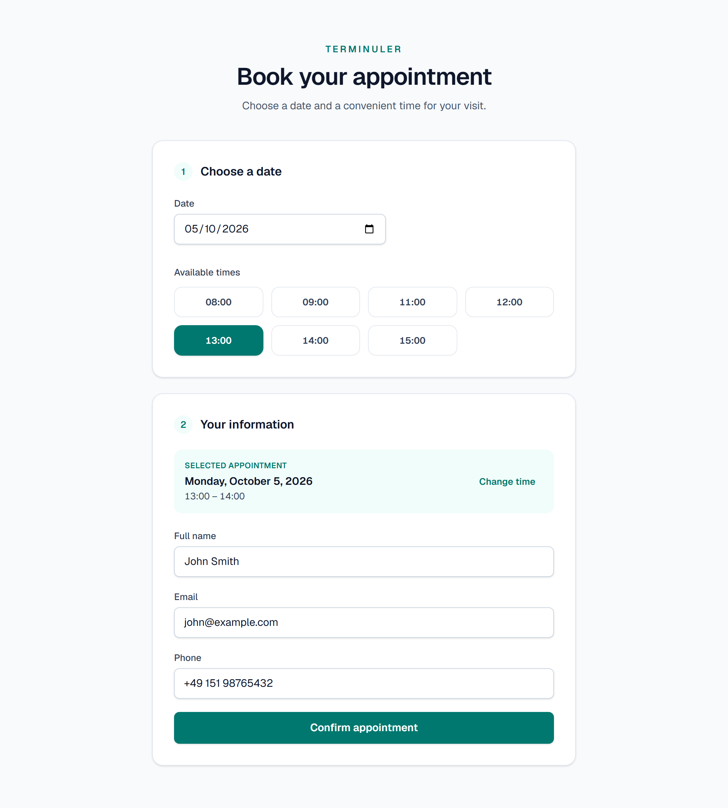
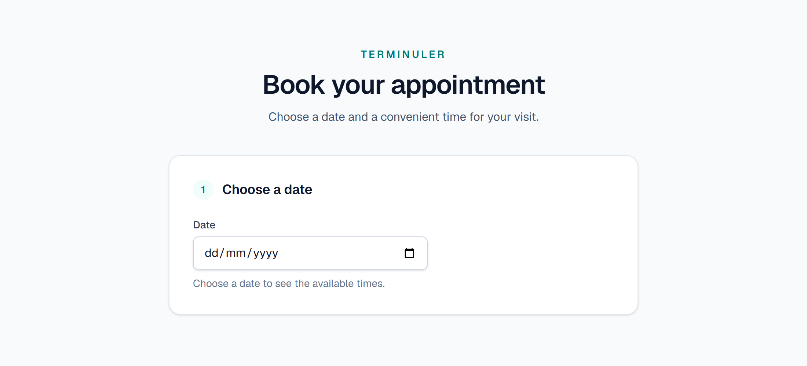
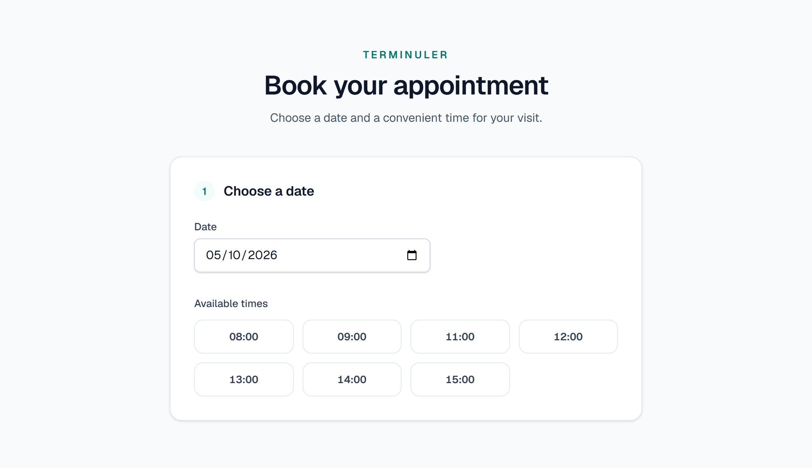
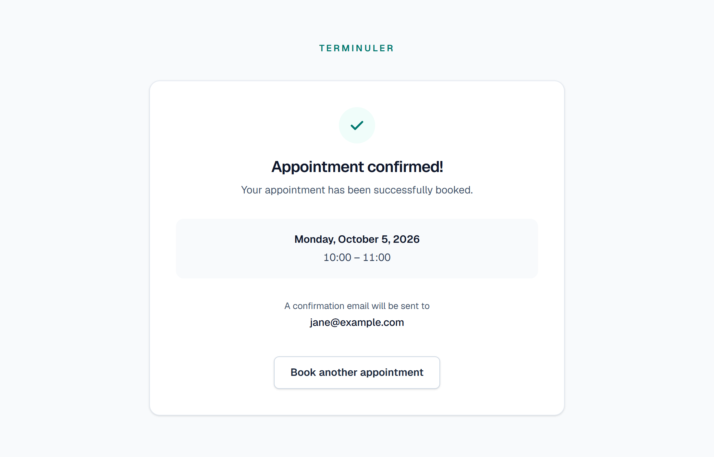
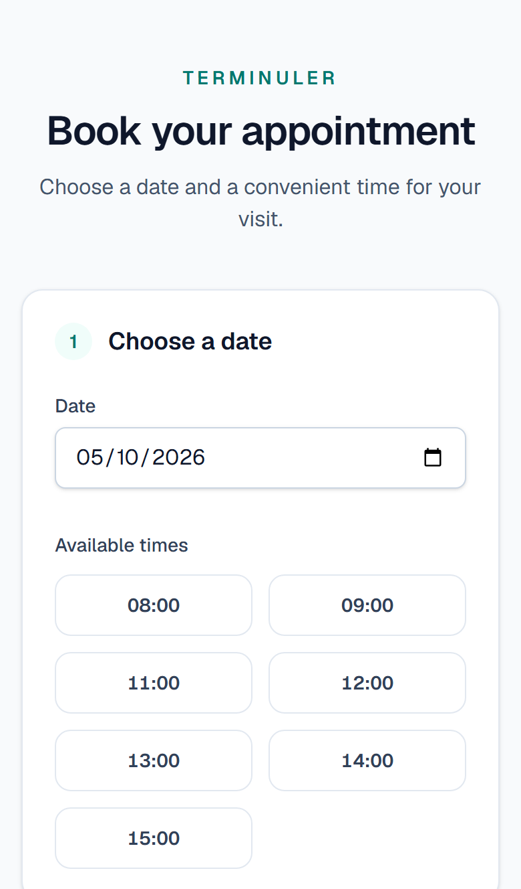
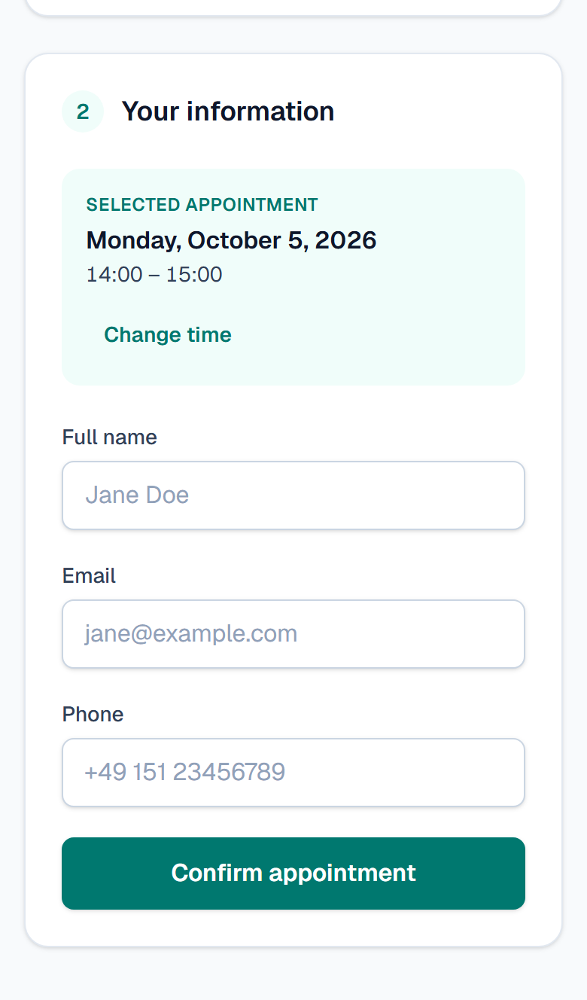
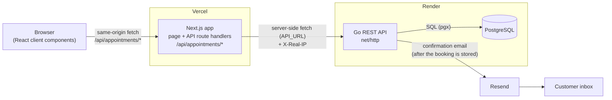
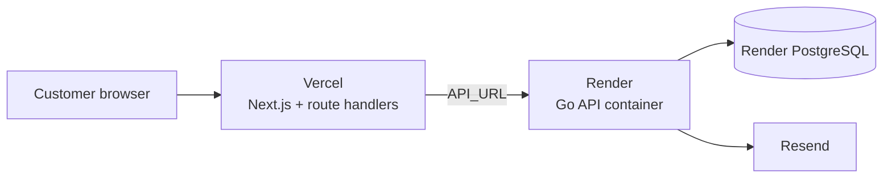

# Terminuler

A full-stack appointment booking application: customers pick a weekday, choose a free one-hour slot, enter their contact details and receive a confirmation email. It is built with a Go REST API, a Next.js frontend, PostgreSQL and Resend.

**Live demo:** [terminuler.vercel.app](https://terminuler.vercel.app/) · **API:** [terminuler-api.onrender.com](https://terminuler-api.onrender.com/health)

[](https://github.com/pitercoding/terminuler/actions/workflows/ci.yml)




---

## Contents

- [Screenshots](#screenshots)
- [Features](#features)
- [Business rules](#business-rules)
- [Architecture](#architecture)
- [Technology stack](#technology-stack)
- [Project structure](#project-structure)
- [Database](#database)
- [Configuration](#configuration)
- [Local development](#local-development)
- [Testing](#testing)
- [API reference](#api-reference)
- [Email](#email)
- [Security and abuse protection](#security-and-abuse-protection)
- [Accessibility and UX](#accessibility-and-ux)
- [CI](#ci)
- [Deployment](#deployment)
- [Engineering decisions](#engineering-decisions)
- [Known limitations](#known-limitations)
- [Future development](#future-development)
- [License](#license)

---

## Screenshots

These screenshots come from the real application, running locally with the same code that is deployed.

| Choose a date | Available times |
| --- | --- |
|  |  |

In the **Available times** screenshot, 10:00 is missing because it was booked just before. Booked and past slots are never offered.

| Customer details | Confirmation |
| --- | --- |
|  |  |

**Mobile.** On small screens the time grid switches from four columns to two. When a slot is selected, the page scrolls the contact form into view, because the form would otherwise appear below the fold.

<p>
  
  &nbsp;&nbsp;
  
</p>

---

## Features

### Customer booking flow

1. **Select a date** with the native date picker. Dates before today are disabled in the picker, and the backend enforces the same rule.
2. **View available slots**: one-hour slots from 08:00 to 16:00, Monday to Friday. Booked slots and slots that have already started are left out.
3. **Select a time**. The selected slot is summarized, with a **Change time** option.
4. **Enter full name, email and phone.**
5. **Confirm**. The appointment is stored, and the confirmation screen shows the date, time and email address.
6. **Confirmation email** sent through Resend.

Related behavior:

- **Double booking is handled.** If someone else books the same slot first, the API returns `409 Conflict`. The UI then explains the conflict, reloads the availability without the taken slot and keeps the details the customer already typed.
- **Validation messages** from the API (`400`) are shown to the customer. Other failures get a generic message instead of technical details.
- **Book another appointment** resets the flow from the confirmation screen.

### Backend

- REST API built on Go's standard `net/http` with method-aware routing. There are three endpoints: [health](#get-health), [availability](#get-appointmentsavailability) and [create appointment](#post-appointments).
- All booking rules are enforced on the server: weekdays, business hours, whole-hour one-hour slots, no past slots and a 60-day booking horizon.
- A PostgreSQL unique constraint guarantees that a slot can only be booked once, even under concurrent requests.
- Strict JSON decoding: unknown fields, trailing data and bodies over 1 MiB are rejected.
- An in-memory sliding-window **rate limit** applies to appointment creation, with trusted-proxy-aware client identification.
- Confirmation emails go through Resend. A `log` mode writes them to the log instead, for tests.
- Embedded, idempotent database migrations.
- HTTP server timeouts and graceful shutdown on `SIGINT`/`SIGTERM`.
- A multi-stage Docker image that runs as a non-root user.

---

## Business rules

All rules are enforced by the Go service ([`appointment_service.go`](backend/internal/services/appointment_service.go)). The frontend only reflects them.

| Rule | Implementation |
| --- | --- |
| **Duration** | Exactly one hour. `end_time` must be `start_time` + 60 minutes. |
| **Business hours** | Slots start between **08:00 and 15:00** and end between **09:00 and 16:00**, which gives 8 slots per day. |
| **Whole hours only** | Start and end times must be on the hour (`HH:00`). |
| **Weekdays** | Monday to Friday. Creating an appointment on a Saturday or Sunday returns `400`. Availability for a weekend date returns an empty list. |
| **No past bookings** | A slot's start time must be strictly after the current time in the business timezone. Slots that have already started today are hidden. Booking them returns `400`. |
| **Booking horizon** | Up to **60 days ahead**, counted from today in the business timezone (today + 60 days is still bookable). Later dates return `400` on creation and an empty list on availability. |
| **Date format** | `YYYY-MM-DD`. An invalid date returns `400`. |
| **Time format** | `HH:MM`. Single-digit hours such as `8:00` are accepted and normalized to `08:00` before storage and in the response. |
| **Customer fields** | Name, phone and email are required. Surrounding whitespace is trimmed. Limits are 255, 50 and 255 characters, matching the column sizes. |
| **Email** | Must be a plain address (`jane@example.com`). Display-name forms such as `Jane <jane@example.com>` are rejected. |
| **Conflicts** | A second booking for the same date and start time violates the `unique_appointment_slot` constraint and returns `409`. |
| **Timezone** | "Now" and "today" are evaluated in `APP_TIMEZONE` (default `UTC`). Dates and times are stored as wall-clock values (`DATE`, `TIME`) in that timezone. |

---

## Architecture



### Request flow

1. The browser only talks to its own origin: `GET /api/appointments/availability` and `POST /api/appointments`.
2. These **Next.js route handlers** ([`frontend/src/app/api`](frontend/src/app/api)) forward the request to the Go API at `API_URL`. They pass the API's status code, JSON body and `Retry-After` header back to the browser. An error without a JSON body keeps its status and gets `{"error": "appointment API responded with status …"}`. Only when the API cannot be reached do they answer `502 {"error": "failed to connect to appointment API"}`.
3. The Go API is layered as **routes → handlers → services → repositories**:
   - handlers decode and encode HTTP and map errors to status codes
   - the service holds the business rules and triggers the email
   - the repository runs SQL and turns a unique violation into a conflict error
4. After the appointment is committed, the service sends the confirmation email through Resend **before** responding. The email is best effort: a failure is logged and the booking still succeeds.

### Why the browser does not call the Go API directly

- **No CORS surface.** The API sends no CORS headers because no browser code calls it cross-origin.
- **The backend URL stays server-side.** `API_URL` is a server-only variable (not `NEXT_PUBLIC_*`), so it is not bundled into client JavaScript.
- **Client IP forwarding.** The proxy passes the caller's IP to the API in `X-Real-IP`, and the rate limiter uses it (see [Rate limiting](#rate-limiting)).

The proxy is **not** an access-control boundary: the Go API is itself publicly reachable. All validation and rate limiting live in the Go API, not in the proxy.

---

## Technology stack

| Layer | Technology | Version | Notes |
| --- | --- | --- | --- |
| Frontend | [Next.js](https://nextjs.org) (App Router) | 16.3.5 | Page plus route handlers used as an API proxy |
| | React | 19.2.8 | |
| | TypeScript | 5.9 | |
| | Tailwind CSS | 4.3 | Via `@tailwindcss/postcss` |
| | ESLint | 9 | `eslint-config-next` |
| | Geist font | – | Loaded with `next/font` |
| Backend | Go | 1.26.2 (`go.mod`) | Standard library `net/http` router (method-aware patterns) |
| | [pgx](https://github.com/jackc/pgx) | v5.11.0 | Used through `database/sql` (`pgx/v5/stdlib`) |
| | [golang-migrate](https://github.com/golang-migrate/migrate) | v4.20.1 | Migrations embedded with `embed.FS` |
| | [resend-go](https://github.com/resend/resend-go) | v4.7.0 | Transactional email |
| | [godotenv](https://github.com/joho/godotenv) | v1.5.1 | Optional `.env` loading |
| Database | PostgreSQL | 18 (Docker image) | |
| Testing | Go `testing` | – | Unit and integration (`-tags=integration`) tests, race detector in CI |
| | [Playwright](https://playwright.dev) | 1.63.0 | Chromium end-to-end tests |
| Infrastructure | Docker / Docker Compose | – | Local PostgreSQL. Multi-stage API image (`golang:1.26-alpine` → `alpine:3.22`) |
| | GitHub Actions | – | Checks, tests and E2E |
| | Vercel | – | Frontend hosting |
| | Render | – | API hosting and managed PostgreSQL |
| | Resend | – | Email delivery |

---

## Project structure

```text
terminuler/
├── .github/workflows/ci.yml          # CI: Go checks/tests, frontend checks, Playwright E2E
├── docker-compose.yml                # Local PostgreSQL 18 (host port 5433)
├── .env.example                      # Template for the repository-root .env
├── docs/images/                      # README screenshots
│
├── backend/                          # Go API (module github.com/pitercoding/terminuler)
│   ├── Dockerfile                    # Multi-stage build: api + migrate binaries
│   ├── cmd/
│   │   ├── api/                      # HTTP server: wiring, timeouts, graceful shutdown
│   │   ├── migrate/                  # Applies pending migrations and exits
│   │   └── e2edb/                    # Creates/migrates/empties the *_test database for E2E
│   └── internal/
│       ├── config/                   # Environment variables, defaults and validation
│       ├── database/                 # Connection, migration runner
│       │   └── migrations/           # Embedded SQL migrations
│       ├── handlers/                 # HTTP handlers, JSON decoding, error mapping
│       ├── services/                 # Business rules: availability and booking validation
│       ├── repositories/             # SQL queries; unique violation → conflict
│       ├── email/                    # Sender interface, Resend and log implementations
│       ├── ratelimit/                # Sliding-window limiter, client IP resolver, middleware
│       ├── routes/                   # Route registration
│       └── models/                   # Appointment model
│
└── frontend/                         # Next.js application
    ├── playwright.config.ts          # Starts API + Next.js for E2E runs
    ├── src/
    │   ├── app/
    │   │   ├── page.tsx              # Booking flow (client component, state machine)
    │   │   ├── layout.tsx            # Root layout, metadata, font
    │   │   └── api/appointments/     # Route handlers proxying to the Go API
    │   ├── components/               # DateSelector, TimeSlotGrid, AppointmentForm, ...
    │   ├── services/                 # Typed fetch client for the proxy routes
    │   └── lib/                      # Date formatting, reduced-motion-aware scrolling
    └── tests/e2e/                    # Playwright specs and helpers
```

---

## Database

### Schema

A single table, created by [`000001_create_appointments.up.sql`](backend/internal/database/migrations/000001_create_appointments.up.sql):

| Column | Type | Notes |
| --- | --- | --- |
| `id` | `BIGSERIAL` | Primary key |
| `appointment_date` | `DATE NOT NULL` | Calendar date in the business timezone |
| `start_time` | `TIME NOT NULL` | e.g. `09:00` |
| `end_time` | `TIME NOT NULL` | e.g. `10:00` |
| `customer_name` | `VARCHAR(255) NOT NULL` | |
| `customer_phone` | `VARCHAR(50) NOT NULL` | |
| `customer_email` | `VARCHAR(255) NOT NULL` | |
| `created_at` | `TIMESTAMPTZ NOT NULL DEFAULT NOW()` | |

```sql
CONSTRAINT unique_appointment_slot UNIQUE (appointment_date, start_time)
```

### How double booking is prevented

Availability is only a snapshot, so two customers can both see the same slot as free. The service does **not** check for a conflict with a `SELECT` before inserting, because that check could itself race. It inserts directly and lets PostgreSQL decide: the unique constraint allows exactly one row per `(appointment_date, start_time)`. Any concurrent insert for the same slot fails with SQLSTATE `23505`. The repository maps that code to `ErrAppointmentConflict`, and the handler returns `409 Conflict`.

This is covered at three levels:

- an integration test fires concurrent inserts for one slot and asserts exactly one succeeds
- handler and service unit tests check the `409` mapping
- a Playwright test books the same slot from two browser contexts

### Migrations

- The SQL files are embedded into the binaries (`//go:embed *.sql`) and applied with golang-migrate. It records the applied version and holds a database lock while migrating, so running migrations repeatedly or concurrently is safe.
- `go run ./cmd/migrate` (from `backend/`) applies pending migrations against `DATABASE_URL`.
- **The API does not migrate on startup when run with `go run ./cmd/api`.** Locally, run the migrate command first.
- The Docker image runs `./migrate && exec ./api`, so every container start applies migrations before serving.

### Databases per environment

| Database | Used by | Notes |
| --- | --- | --- |
| `terminuler` (Docker Compose) | Local development | Persisted in the `terminuler-postgres-data` volume |
| Temporary schema `test_<timestamp>` | Integration tests | Created inside the database in `TEST_DATABASE_URL`, migrated, then dropped. Existing data is not touched. |
| `terminuler_test` | Playwright E2E | Created if missing, migrated and **emptied on every run** by `cmd/e2edb`. That command refuses any database whose name does not end in `_test`. |
| Render PostgreSQL | Production | Connection string provided through `DATABASE_URL` |

---

## Configuration

### Backend (Go API)

The API reads environment variables. For local development it also loads a `.env` file, looking first in the working directory and then in its parent. Running from `backend/` therefore picks up the repository-root `.env`. **Variables already set in the environment always win over the file.** Invalid values stop the API at startup with a descriptive error.

| Variable | Required | Default | Description |
| --- | --- | --- | --- |
| `DATABASE_URL` | **Yes** | – | PostgreSQL connection string. |
| `PORT` | No | `8080` | HTTP port. |
| `APP_TIMEZONE` | No | `UTC` | IANA timezone for business hours, "today" and the booking horizon, e.g. `Europe/Berlin`. The timezone database is embedded in the binary. |
| `APPOINTMENT_RATE_LIMIT` | No | `5` | Appointment creations allowed per client per minute. Must be a positive integer. |
| `TRUSTED_PROXIES` | No | *(empty)* | Comma-separated CIDRs or IPs allowed to supply the client IP in `X-Real-IP`. When empty, the header is ignored. |
| `EMAIL_PROVIDER` | No | `resend` | `resend` sends real emails. `log` only writes them to the API log. Any other value is rejected. |
| `RESEND_API_KEY` | When `EMAIL_PROVIDER=resend` | – | Resend API key. If it is missing, startup fails rather than silently skipping emails. |
| `RESEND_FROM_EMAIL` | No | `onboarding@resend.dev` | Sender address. The default testing sender only delivers to the Resend account owner, so use an address on a domain verified in Resend. |

### Docker Compose (local PostgreSQL)

| Variable | Description |
| --- | --- |
| `POSTGRES_DB`, `POSTGRES_USER`, `POSTGRES_PASSWORD` | Used by `docker-compose.yml` to initialize the container. They must match the credentials in `DATABASE_URL`. |

### Tests

| Variable | Used by | Description |
| --- | --- | --- |
| `TEST_DATABASE_URL` | Go integration tests | **Must be set in the shell.** The integration tests read it with `os.Getenv` and do not load `.env`. |
| `E2E_DATABASE_URL` | Playwright | Optional. Read from the environment or the root `.env`. It defaults to `DATABASE_URL` with the database name replaced by `terminuler_test`, and the name must end in `_test`. |

### Frontend (Next.js)

| Variable | Required | Default | Description |
| --- | --- | --- | --- |
| `API_URL` | No (local) / **Yes** (production) | `http://localhost:8080` | Base URL of the Go API, read only by the server-side route handlers. Locally it can go in `frontend/.env.local` or be omitted. |

> **Secrets.** `.env` and `.env.*` files are git-ignored (only `.env.example` is committed), and `backend/.dockerignore` keeps them out of the Docker build context. Real credentials, especially `RESEND_API_KEY` and production `DATABASE_URL` values, must only live in local `.env` files or in the hosting providers' environment settings. They must never be committed.

---

## Local development

### Prerequisites

| Tool | Version |
| --- | --- |
| Git | any recent |
| Go | 1.26.2 or newer (from `backend/go.mod`) |
| Node.js + npm | Node 22 (the version used in CI) |
| Docker with Compose | For the local PostgreSQL 18 container |

A Resend account is **not** required for local development if you use `EMAIL_PROVIDER=log`.

### 1. Clone and configure

```bash
git clone https://github.com/pitercoding/terminuler.git
cd terminuler
cp .env.example .env        # PowerShell: Copy-Item .env.example .env
```

Edit `.env`:

- Replace `change_me` in **both** `POSTGRES_PASSWORD` and `DATABASE_URL` with the same password.
- To run without Resend, set `EMAIL_PROVIDER=log`. Confirmation emails then appear in the API log.
- If you keep `EMAIL_PROVIDER=resend`, put a real key in `RESEND_API_KEY`. Otherwise every send fails. Bookings still succeed, but each failure is logged.

### 2. Start PostgreSQL

```bash
docker compose up -d
```

PostgreSQL listens on **`localhost:5433`**, not the default 5432, so it does not collide with a local installation.

### 3. Run migrations and start the API

```bash
cd backend
go run ./cmd/migrate
go run ./cmd/api
```

The API runs on `http://localhost:8080`. Check it with:

```bash
curl http://localhost:8080/health
# {"status":"ok"}
```

### 4. Start the frontend

In a second terminal:

```bash
cd frontend
npm ci
npm run dev
```

Open `http://localhost:3000`. The route handlers use `http://localhost:8080` by default. To point them elsewhere, create `frontend/.env.local`:

```bash
API_URL=http://localhost:8080
```

### Local URLs

| Service | URL |
| --- | --- |
| Frontend (Next.js dev server) | `http://localhost:3000` |
| Go API | `http://localhost:8080` |
| PostgreSQL | `localhost:5433` |
| E2E API / web (started by Playwright) | `http://localhost:8081` / `http://localhost:3001` |

---

## Testing

The project is tested at four levels: Go unit tests, Go integration tests against PostgreSQL, static checks and a production build of the frontend, and Playwright end-to-end tests through the whole stack.

### Backend unit tests

```bash
cd backend
go test ./...
```

These cover configuration parsing, the booking rules (horizon, past slots, timezone handling, normalization), handler status codes and JSON handling, route and method registration, the limiter (sliding window, concurrency, sweeping), client IP resolution (trusted proxies, spoofing, IPv6) and the log email sender. The clock is injected, so time-dependent rules are tested deterministically.

### Race detector

```bash
go test -race ./...
```

CI runs both unit and integration tests with `-race`. The race detector requires cgo and a C compiler. On Windows without a 64-bit GCC toolchain it will not build, so use the tests without `-race` or rely on CI.

### Integration tests

Integration tests are behind the `integration` build tag. They connect to a real PostgreSQL, create an isolated schema, apply the migrations, and drop the schema at the end. They exercise the repository and the full service → repository flow, including the concurrent-booking test.

`TEST_DATABASE_URL` must be exported in the shell, because it is **not** read from `.env`:

```bash
# bash
TEST_DATABASE_URL="postgres://terminuler:<password>@localhost:5433/terminuler" \
  go test -tags=integration ./...
```

```powershell
# PowerShell
$env:TEST_DATABASE_URL = "postgres://terminuler:<password>@localhost:5433/terminuler"
go test -tags=integration ./...
```

With the tag set, `./...` runs the unit tests as well.

### Formatting and vet (as in CI)

```bash
cd backend
gofmt -l .
go vet ./...
go vet -tags=integration ./...
```

### Frontend checks

```bash
cd frontend
npx next typegen     # generates next-env.d.ts and route types (not committed)
npx tsc --noEmit
npm run lint
npm run build
```

### End-to-end tests (Playwright)

```bash
cd frontend
npx playwright install chromium     # first time only
npm run test:e2e                    # headless
npm run test:e2e:ui                 # Playwright UI mode
```

How the E2E setup works ([`playwright.config.ts`](frontend/playwright.config.ts)):

- **Real stack, real browser.** The tests drive Chromium through browser → Next.js route handlers → Go API → PostgreSQL. Nothing is mocked.
- **Playwright starts its own servers.** The API runs on port **8081** via `go run ./cmd/e2edb && go run ./cmd/api`. The frontend runs on port **3001** as a production build (`npm run build && npm run start`), because a second `next dev` cannot run next to the development server. This lets the E2E suite run while the dev servers are up. Running servers are never reused.
- **Separate database.** `cmd/e2edb` creates `terminuler_test` if it is missing, migrates it and truncates `appointments` before the API starts. It refuses to touch any database whose name does not end in `_test`.
- **No real emails.** The API runs with `EMAIL_PROVIDER=log`.
- **Rate limit raised** to 1000/min, since all bookings come from one machine. The limiter has its own unit tests.
- **Only PostgreSQL must already be running** (`docker compose up -d`), and Go must be installed.

The two scenarios:

| Spec | What it verifies |
| --- | --- |
| [`booking.spec.ts`](frontend/tests/e2e/booking.spec.ts) | A full booking: choose a date, select the first free slot (`aria-pressed`), fill in details, then `POST` returns **201** and the confirmation screen shows the date, time and email. Choosing the same date again no longer offers the booked slot. |
| [`booking-conflict.spec.ts`](frontend/tests/e2e/booking-conflict.spec.ts) | Two browser contexts ("Alice" and "Bob") select the same slot. Alice books first, and Bob's booking returns **409**. Bob sees the conflict message, the form closes, and the availability reloads without the taken slot. His details are kept, and he books another slot. |

On failure, Playwright keeps traces and screenshots in `frontend/test-results/`.

---

## API reference

Base URLs: `https://terminuler-api.onrender.com` (production) · `http://localhost:8080` (local).

All error responses share one shape:

```json
{ "error": "human-readable message" }
```

Routes are registered with method-aware patterns. A wrong method gets `405 Method Not Allowed` with an `Allow` header, and `GET` routes also answer `HEAD`.

### `GET /health`

Liveness check. It does not query the database.

```json
200 OK
{ "status": "ok" }
```

### `GET /appointments/availability`

Returns the free slots for a date.

| Query parameter | Required | Format |
| --- | --- | --- |
| `date` | Yes | `YYYY-MM-DD` |

```bash
curl "http://localhost:8080/appointments/availability?date=2026-10-05"
```

```json
200 OK
{
  "date": "2026-10-05",
  "available_slots": [
    { "start_time": "08:00", "end_time": "09:00" },
    { "start_time": "09:00", "end_time": "10:00" },
    { "start_time": "11:00", "end_time": "12:00" }
  ]
}
```

`available_slots` is always an array. It is empty (`[]`) for weekends, dates beyond the 60-day horizon, fully booked days, and days whose last slot has already started (including past dates).

| Status | Body `error` | When |
| --- | --- | --- |
| `400` | `date query parameter is required` | `date` missing |
| `400` | `invalid date format, expected YYYY-MM-DD` | `date` not parseable |
| `500` | `internal server error` | Database failure (details only in the server log) |

### `POST /appointments`

Books a slot. Rate limited per client (see [Rate limiting](#rate-limiting)).

```bash
curl -X POST http://localhost:8080/appointments \
  -H "Content-Type: application/json" \
  -d '{
    "appointment_date": "2026-10-05",
    "start_time": "13:00",
    "end_time": "14:00",
    "customer_name": "Jane Doe",
    "customer_phone": "+49 151 23456789",
    "customer_email": "jane@example.com"
  }'
```

All six fields are strings and required. Unknown fields are rejected.

```json
201 Created
{
  "id": 1,
  "appointment_date": "2026-10-05",
  "start_time": "13:00",
  "end_time": "14:00",
  "customer_name": "Jane Doe",
  "customer_phone": "+49 151 23456789",
  "customer_email": "jane@example.com",
  "created_at": "2026-09-29T14:57:01.123456Z"
}
```

`appointment_date` is returned as a plain `YYYY-MM-DD` date, so browsers do not shift it to the previous day when converting from UTC.

| Status | Body `error` | When |
| --- | --- | --- |
| `400` | `invalid request body` | Malformed JSON, unknown fields, wrong types, or more than one JSON value |
| `400` | Validation message, e.g. `customer email is required`, `invalid customer email`, `appointments are not available on weekends`, `appointments must start and end on the hour`, `appointment start time must be between 08:00 and 15:00`, `appointment end time must be between 09:00 and 16:00`, `appointment must last exactly one hour`, `appointment must be scheduled in the future`, `appointment date must be within the next 60 days` | A business rule is violated |
| `409` | `appointment slot is already booked` | The slot was taken (unique constraint) |
| `413` | `request body too large` | Body over 1 MiB |
| `429` | `rate limit exceeded` | Too many creations from this client. Includes a `Retry-After` header in seconds. |
| `500` | `internal server error` | Unexpected failure (details only in the server log) |

### Next.js proxy routes

The browser uses these same-origin routes, which mirror the API:

| Route | Forwards to |
| --- | --- |
| `GET /api/appointments/availability?date=…` | `GET {API_URL}/appointments/availability?date=…` |
| `POST /api/appointments` | `POST {API_URL}/appointments`, adding `X-Real-IP` |

They return the API's status and JSON body unchanged. The `POST` route also forwards `Retry-After`, and the availability route answers `400` itself when `date` is missing. Any failure inside the route handler, such as an unreachable API or a response that is not JSON, returns `502 {"error": "failed to connect to appointment API"}`.

---

## Email

Confirmation emails are sent through the `email.Sender` interface, which has two implementations. `EMAIL_PROVIDER` selects one at startup.

| `EMAIL_PROVIDER` | Implementation | Behavior |
| --- | --- | --- |
| `resend` (default) | `ResendSender` | Sends an HTML email ("Appointment confirmation") with the customer's name, date and time through the Resend API. Requires `RESEND_API_KEY`. The sender is `RESEND_FROM_EMAIL`. |
| `log` | `LogSender` | Writes recipient, name, date and time to the API log and never fails. Used by the E2E tests and handy for local development. |

Design details:

- **Best effort, after persistence.** The email is sent only after the appointment has been stored. A send failure is logged and the booking still returns `201`, so a flaky email provider cannot make a stored booking look failed.
- **Bounded.** Each Resend request has a 10-second timeout. The server's write timeout (20 s) is deliberately longer, so a slow send cannot cut off the booking response.
- **Escaped.** The customer name is user input and is HTML-escaped before being inserted into the email body.
- **Sender domain.** The default `onboarding@resend.dev` sender only delivers to the Resend account owner. Delivering to arbitrary customers requires an address on a domain verified in Resend.
- **E2E tests never send real emails**, because they always run with `EMAIL_PROVIDER=log`.

---

## Security and abuse protection

The measures below are implemented. They make the API reasonably robust for a small public demo, but they are not a full security program (see [Known limitations](#known-limitations)).

### Input handling

- **Body size limit.** `POST /appointments` bodies are capped at 1 MiB with `http.MaxBytesReader`. Larger bodies get `413`.
- **Strict JSON.** `DisallowUnknownFields`, and a check that the body holds exactly one JSON value. Trailing whitespace is allowed.
- **Server-side validation** of every field and business rule, independent of the frontend.
- **Parameterized SQL** for all application queries. The E2E helper's `CREATE DATABASE`, which cannot take parameters, quotes the name with `pgx.Identifier`.
- **Integrity in the database.** Double bookings are prevented by a unique constraint, not by application checks.

### Rate limiting

`POST /appointments` is wrapped in a rate-limiting middleware ([`internal/ratelimit`](backend/internal/ratelimit)). Reads and `/health` are not limited.

- **Default:** 5 requests per client per minute (`APPOINTMENT_RATE_LIMIT`).
- **Sliding window.** The limiter keeps the timestamps of accepted requests, so a client cannot fit twice the limit around a fixed-window boundary. Rejected requests are not recorded, so retrying early does not extend the wait. Every request that passes the limiter counts, including ones later rejected with `400` or `409`.
- **Response.** `429` with `{"error":"rate limit exceeded"}` and a `Retry-After` header. The value is the number of seconds until the oldest request leaves the window, rounded up and at least 1.
- **Memory.** Idle clients are swept at most once per window, without a background goroutine.

**Client identification:**

1. The client is normally the connection's remote address.
2. `X-Real-IP` is trusted **only** if the connection comes from a network listed in `TRUSTED_PROXIES`. That network is the Next.js server, which sets the header from the last `X-Forwarded-For` entry. Anyone else sending `X-Real-IP` is ignored, so the header cannot be spoofed to escape the limit.
3. If a trusted proxy sends no valid `X-Real-IP`, the proxy's own address is used. The requests share one limit rather than bypassing it.
4. **IPv6** clients are grouped by their **/64** prefix, because a single client usually controls a whole /64 and could otherwise rotate addresses. IPv4-mapped IPv6 addresses are normalized to IPv4.
5. Requests whose address cannot be parsed share a single `unknown` bucket.

If `TRUSTED_PROXIES` does not match the address the proxy connects from, every customer arriving through the proxy shares one limit. This fails safe but is coarse, so in production the value has to match the platform's actual network path.

### HTTP server

| Setting | Value | Purpose |
| --- | --- | --- |
| `ReadHeaderTimeout` | 5 s | Slow-header (Slowloris-style) protection |
| `ReadTimeout` | 10 s | Bounds reading the whole request |
| `WriteTimeout` | 20 s | Longer than the 10 s email timeout |
| `IdleTimeout` | 60 s | Limits idle keep-alive connections |
| Graceful shutdown | 15 s | On `SIGINT`/`SIGTERM`, in-flight requests get up to 15 s to finish. A second signal stops the process immediately. |

### Secrets and error exposure

- Secrets come only from environment variables. `.env` files are git-ignored and excluded from the Docker build context.
- Unexpected errors return a generic `internal server error`. Database and driver details are only logged on the server.
- The frontend shows API messages only for `400` validation errors. Everything else gets a generic message.
- The Docker image runs as an unprivileged user (UID 10001). On top of `alpine:3.22` it adds only CA certificates and two static binaries.
- The CI workflow runs with read-only repository permissions.

---

## Accessibility and UX

Everything below is implemented in [`frontend/src`](frontend/src):

- **Native, keyboard-operable controls.** Date input, buttons and form fields are real HTML elements, and every input has an associated `<label>`. The fields use `type="email"`, `type="tel"` and `autocomplete` (`name`, `email`, `tel`), and their `maxLength` values mirror the API limits.
- **Time slots** are buttons in a `role="group"` labelled "Available times". Each has an `aria-label` such as "08:00 to 09:00", and `aria-pressed` marks the selection.
- **Focus management.** After booking, focus moves to the "Appointment confirmed!" heading, so screen readers announce the result. Custom `focus-visible` outlines are shown on interactive elements.
- **Status and errors.** The loading skeleton is a `role="status"` region with screen-reader text. Error messages use `role="alert"`, and availability errors offer a **Try again** button. The date hint is linked through `aria-describedby`.
- **Submitting state.** During submission the fieldset is disabled and the button reads "Confirming appointment...". This also prevents double submits.
- **Responsive layout.** The time grid has two columns on phones and four from the `sm` breakpoint up. On small screens the form, and any conflict message, is scrolled into view when it appears.
- **Reduced motion.** Programmatic scrolling is smooth unless the user prefers reduced motion, in which case it jumps.
- **Robust state.** Availability responses that arrive out of order are discarded, so only the latest selected date is shown. Customer details survive a `409` conflict.
- **Dates without timezone surprises.** Dates are displayed from their `YYYY-MM-DD` parts rather than parsed as UTC. The picker's minimum date uses the browser's local date.
- **Metadata.** Page title "Terminuler — Book an Appointment", a description, an SVG favicon and `lang="en"`. The design is light-only (`color-scheme: light`), so native controls don't switch to dark styling.

---

## CI

[`.github/workflows/ci.yml`](.github/workflows/ci.yml) runs on every **push to `main`** and every **pull request targeting `main`**. A new push to the same ref **cancels the run in progress** (`concurrency` with `cancel-in-progress`).

| Job | Steps |
| --- | --- |
| **Backend (Go)** | Go version from `go.mod`, `gofmt -l` check, `go vet` (with and without the `integration` tag), `go test -race ./...`, and `go test -race -tags=integration ./...` against a **PostgreSQL 18 service container** |
| **Frontend (Next.js)** | Node 22, `npm ci`, `next typegen` + `tsc --noEmit`, `npm run lint`, `npm run build` |
| **E2E (Playwright)** | Runs after both jobs pass. Sets up Go and Node, installs Chromium with system dependencies, and runs `npm run test:e2e` against a PostgreSQL 18 service container (`terminuler_test`). **On failure**, it uploads `frontend/test-results/` (traces and screenshots) as an artifact kept for 7 days. |

Service-container credentials are disposable and exist only inside the job. Deployment is not part of this workflow.

---

## Deployment

| Component | Platform | URL |
| --- | --- | --- |
| Frontend | Vercel | [terminuler.vercel.app](https://terminuler.vercel.app/) |
| Backend API | Render | [terminuler-api.onrender.com](https://terminuler-api.onrender.com/health) |
| Database | Render PostgreSQL | private |
| Email | Resend | – |



### Backend container

[`backend/Dockerfile`](backend/Dockerfile) builds two static binaries (`api` and `migrate`, `CGO_ENABLED=0`) and copies them into `alpine:3.22` with CA certificates, running as a non-root user. The start command is:

```sh
./migrate && exec ./api
```

Migrations run on every start because hosts without a pre-deploy step, such as Render's free tier, have nowhere else to run them. They are idempotent and lock-guarded. `exec` makes the API PID 1, so it receives `SIGTERM` directly and shuts down gracefully. The host sets `PORT`, and the image defaults to `8080`.

### Production configuration (conceptual)

Set these in the providers' dashboards and never in the repository:

- **Render (API):** `DATABASE_URL` (Render PostgreSQL connection string), `APP_TIMEZONE`, `EMAIL_PROVIDER=resend`, `RESEND_API_KEY`, `RESEND_FROM_EMAIL`, `CLERK_SECRET_KEY`, `ADMIN_CLERK_USER_ID`, and optionally `APPOINTMENT_RATE_LIMIT` and `TRUSTED_PROXIES`. `PORT` is provided by Render.
- **Vercel (frontend):** `API_URL=https://terminuler-api.onrender.com`, `NEXT_PUBLIC_CLERK_PUBLISHABLE_KEY` and `CLERK_SECRET_KEY`.

The API refuses to start without `CLERK_SECRET_KEY` or `ADMIN_CLERK_USER_ID`, and both Clerk secret keys must belong to the same Clerk instance as the publishable key: a token from another instance is rejected with `401`.

### Operational notes

- **Cold starts.** Render's free web services spin down after a period of inactivity. When the API is running on that tier, the first request after idle time can take noticeably longer while the container starts and runs migrations. The frontend shows its loading state in the meantime.
- **Single instance.** Rate-limit state lives in process memory. It resets on restart or redeploy and is not shared between instances.
- **Health check.** `/health` reports that the process is serving HTTP. It does not verify database connectivity.

---

## Engineering decisions

**Standard library `net/http` instead of a web framework.** Go 1.22+ routing patterns (`"POST /appointments"`) provide method matching, `405` responses and `HEAD` support. With three endpoints, a framework would add dependencies without adding capability. Middleware is plain `func(http.Handler) http.Handler`.

**The database owns booking integrity.** A read-then-write availability check in application code is inherently racy. The `UNIQUE (appointment_date, start_time)` constraint makes PostgreSQL the single arbiter, and the unique-violation code is translated into a domain error (`409`). A concurrent integration test and a two-browser E2E test verify this.

**Business rules in a service with an injected clock.** Validation lives in one place and receives `now` as a function. Rules like "no past slots", "60-day horizon" and "today in `APP_TIMEZONE`" are therefore deterministic in tests, including timezone edge cases.

**Explicit timezone handling.** The business timezone is configurable, and the tz database is embedded (`time/tzdata`) so it works on minimal images and Windows. The API returns dates as plain `YYYY-MM-DD`, and the frontend never parses them as UTC, which avoids the classic "off by one day" bug.

**Next.js route handlers as a proxy.** The browser only makes same-origin requests, so the Go API needs no CORS configuration and its URL is not shipped to clients. The proxy also passes the client IP in a controlled header.

**In-memory sliding-window rate limiter.** The API runs as a single instance, so in-process state is enough and avoids operating Redis. The sliding window avoids fixed-window bursts. Trusting `X-Real-IP` only from configured CIDRs keeps the header from being spoofed, and /64 grouping prevents trivial IPv6 rotation. The package documents its single-instance assumption.

**Best-effort, synchronous confirmation email.** Sending inside the request keeps the architecture simple: no queue or worker. The booking is committed first, and email failures are logged instead of reported, so the customer never sees a false failure. The trade-off is a slower response when the provider is slow, bounded by a 10 s timeout, and no automatic retry.

**Fail fast on configuration.** Missing `DATABASE_URL`, an invalid timezone, a bad rate limit, an unknown email provider, or `EMAIL_PROVIDER=resend` without a key all stop the API at startup. Nothing is silently disabled in production.

**Timeouts and graceful shutdown.** Every server timeout is set explicitly. The write timeout is derived from the email timeout, and shutdown drains in-flight requests. This matters on platforms that send `SIGTERM` on each deploy.

**Separate, self-guarding E2E database.** E2E runs need a clean, predictable state, so `cmd/e2edb` creates and truncates a dedicated database. It refuses anything not named `*_test`, which protects development data from a misconfigured URL.

**Production Next.js build for E2E.** Running `next build && next start` on separate ports lets the E2E suite run next to the dev server, and it tests the build that actually gets deployed.

**Why no Redis, queues or ORM.** The current scope is one table, three endpoints and one instance. The design leaves clear seams for these if needed: the `Sender` interface, the repository interface consumed by the service, and the rate-limit middleware. They are not introduced before they solve a real problem.

---

## Known limitations

These are deliberate scope boundaries of the current version, not bugs:

- **No authentication, admin UI or appointment management.** Appointments cannot be viewed, cancelled or rescheduled from the application. That currently requires direct database access.
- **Fixed schedule.** Business hours (08:00–16:00), the weekday rule and the 60-day horizon are constants in code. There is no support for holidays, breaks, multiple staff or resources.
- **Minimal customer validation.** Phone numbers are only checked for presence and length. Nothing limits how many slots one person can book beyond the per-IP rate limit.
- **Rate limiting is per process** and in memory, so it is not suitable for multiple API instances without a shared store.
- **Email delivery is not tracked or retried.** There is no outbox or background job. If Resend is unavailable, the booking succeeds and the email is lost (and logged). Delivery to arbitrary recipients requires a Resend-verified sender domain.
- **Observability is basic:** standard-library logging only, with no structured logs, metrics or tracing, and a liveness-only health check.
- **Backups** are not configured in this repository and depend on the database provider's plan.
- **UI:** English only, light theme only.

---

## Future development

A natural next step is an **administrative dashboard** for viewing and managing appointments (listing, cancelling, rescheduling), with authentication in front of it. It would build on the existing API and schema.

---

## License

[MIT](LICENSE) © 2026 Piter Gomes
